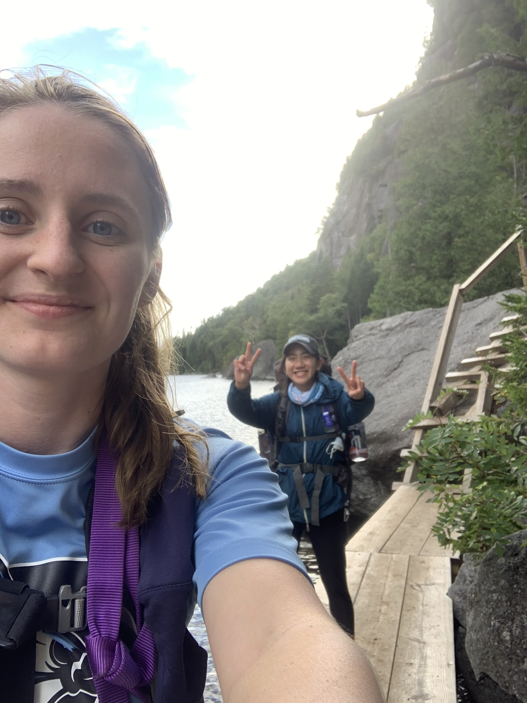

### Meet Zoe
Hey everyone! My name is Zoe, and I am from NYC. I am a current public health graduate at Columbia University student studying Epidemiology and Biostatistics. Following graduation, I hope to work with non for profits researching various social and health policy issues. Currently, I am working on my thesis studying the School to Prison Pipeline in NYC. Before starting my thesis, I volunteered with Community Health Advocates providing advocacy and representation services to New Yorkers to help them understand their health insurance, resolve medical billing issues, and access affordable healthcare. Before that, I was a public school teacher in NYC at School of the Future. My interests in life align with all things related to public health! I hope to devote my life to being a health educator, public policymaker, and community advocator. 

### Fun Facts 
* I love anything and everything to do with the outdoors

* I have a twin brother - meet Oliver! 

* I recently adopted two cats! Meet Luna and Ottis! 

### Contact Information

* Zoe Verzani
* Research: [Critical Social Epidemiology](https://criticalsocialepi.org/people/zoe/)
* Email: [zoe.verzani@columbia.edu](mailto:zoe.verzani@columbia.edu)  
* Phone: 914-860-4659
* New York, NY, USA 